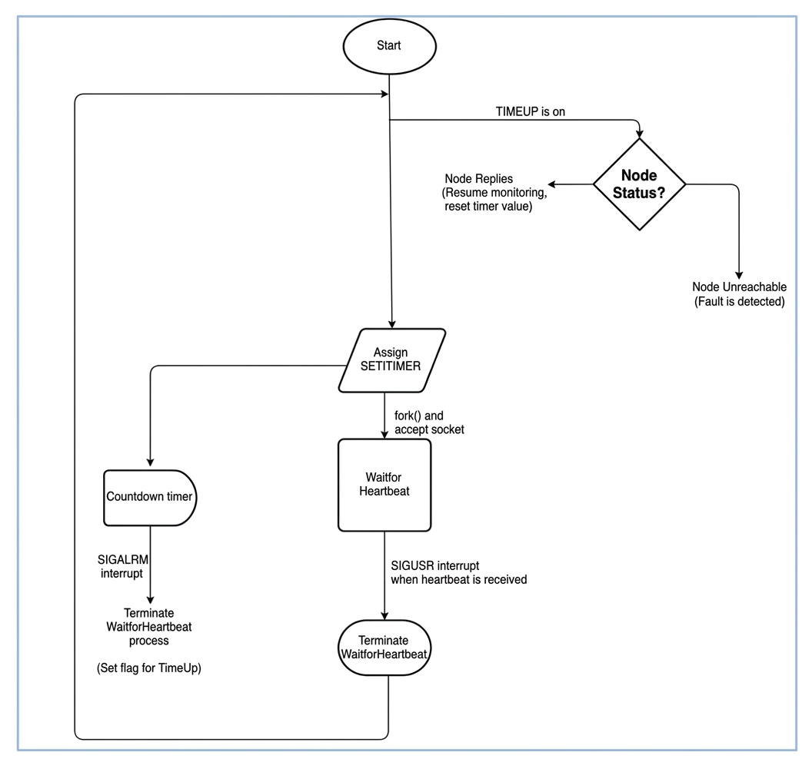

# Fault-Tolerant Distributed System 

This project demonstrates the design of a fault-tolerant distributed system that achieves high availability through replication, heartbeat-based failure detection, and automated failover.

---

## Why This Matters

Modern distributed systems must remain available even when individual nodes fail. This project explores how to eliminate single points of failure (SPOF) and maintain service continuity using replication and automated recovery mechanisms.

---

## System Architecture

  

This architecture illustrates how client requests are routed through a proxy to multiple nodes, how state is replicated across nodes, and how failures are detected using heartbeat monitoring.

---

## Key Concepts

- Distributed systems architecture  
- Fault tolerance and high availability  
- Replication (data and state synchronization)  
- Heartbeat-based adaptive failure detection  
- Automated failover and recovery  
- Load distribution via proxy  

---

## Failure Handling Flow

  

1. **Failure Detection**  
   Nodes are continuously monitored using heartbeat signals over socket communication. Missing heartbeats (within an adaptive timeout value) indicate potential failure.

2. **Failover Selection**  
   When a node fails, another node is selected and promoted to take over responsibilities.

3. **Traffic Redirection**  
   The proxy updates routing logic and redirects incoming requests to healthy nodes.

4. **System Recovery (Optional)**  
   The failed node can rejoin the cluster and resynchronize its state from peers.

---

## Key Design Decisions

- Used heartbeat-based failure detection for simplicity and responsiveness  
- Designed replication to maintain system state across nodes  
- Introduced proxy-based routing to isolate clients from node failures  
- Prioritized availability over strict consistency  

---

## Example implementation in a virtualized distributed system

- Nodes send periodic heartbeats  
- A timeout is maintained to adapt to network latency or potential system load on each node
- If no heartbeat is received within an adaptive timeout, the node is considered failed  

  

---

## Notes

This project focuses on system design and reliability engineering rather than full production implementation. It reflects practical approaches to building resilient distributed systems.

---

## Author

Emma Ahmad Sirajudin  
MSc. Computer Science (Universiti Malaysia Terengganu) 
